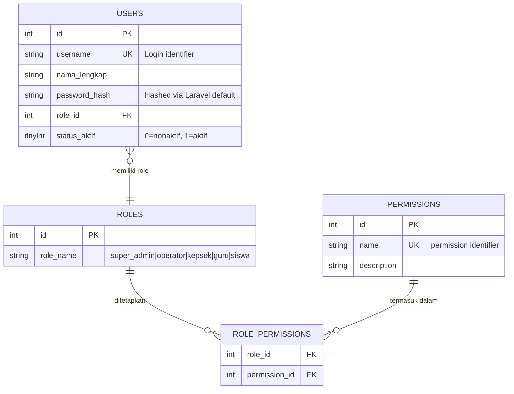
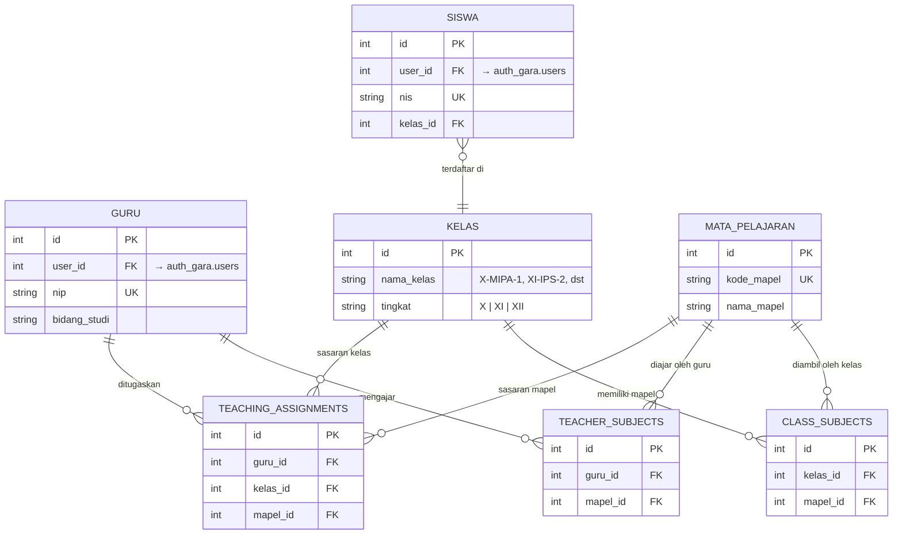
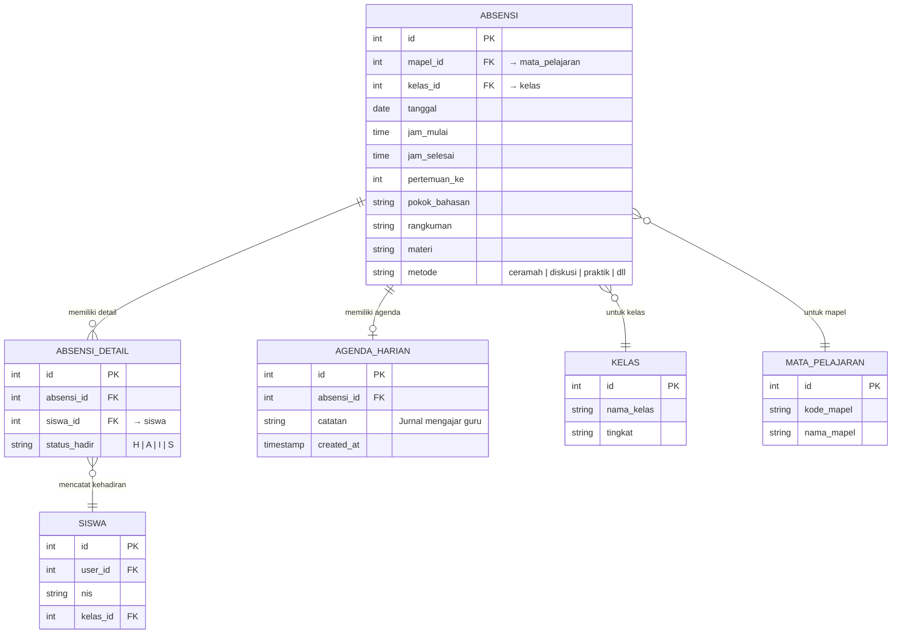
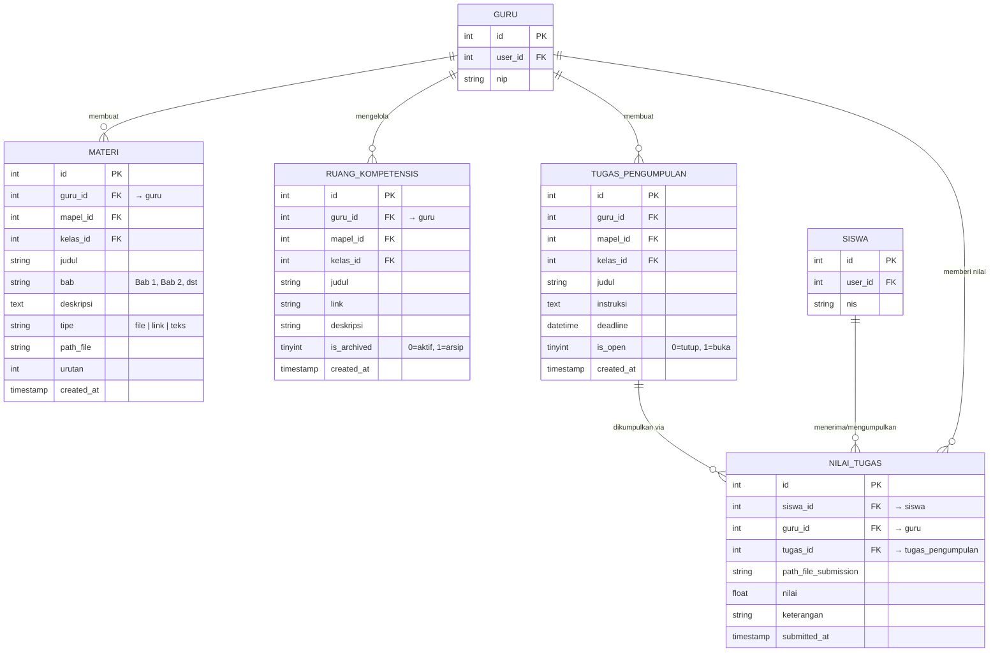
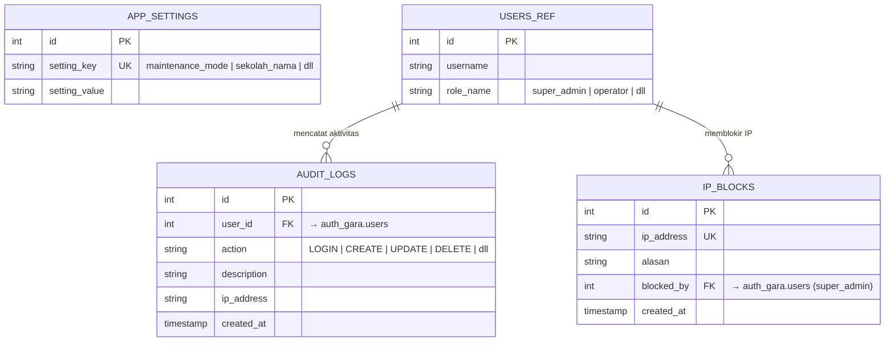
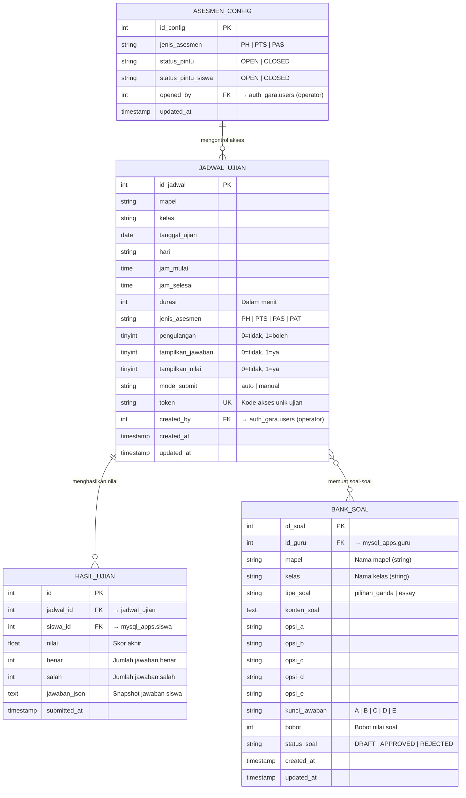
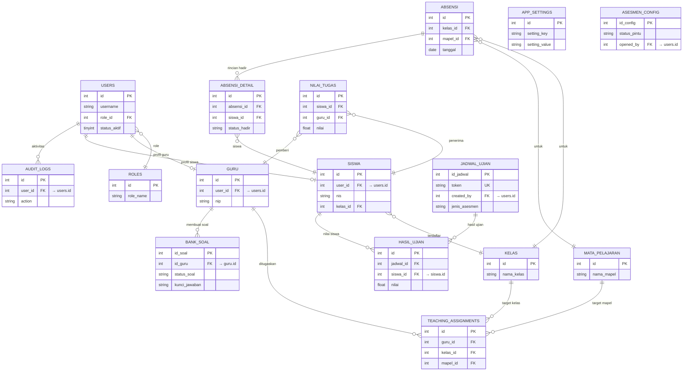

# 🗄️ GARA — Entity Relationship Diagram (ERD)

Dokumen ini berisi diagram ERD lengkap untuk seluruh database pada platform GARA, dibagi ke dalam 3 database terpisah sesuai arsitektur multi-koneksi Eloquent.

> **Cara pakai:** Copy blok ` ```mermaid ``` ` ke [https://mermaid.live](https://mermaid.live) untuk preview.

---

## Arsitektur Database

```
┌─────────────────┐   ┌──────────────────┐   ┌─────────────────────┐
│   mysql_auth    │   │   mysql_apps     │   │   mysql_asesmen     │
│  ─────────────  │   │  ──────────────  │   │  ─────────────────  │
│  users          │   │  guru            │   │  bank_soal          │
│  roles          │   │  siswa           │   │  jadwal_ujian       │
│  permissions    │   │  kelas           │   │  asesmen_config     │
│  role_perms     │   │  mata_pelajaran  │   │  hasil_ujian        │
│                 │   │  class_subjects  │   │                     │
│                 │   │  teacher_subj.   │   │                     │
│                 │   │  teach_assign.   │   │                     │
│                 │   │  absensi         │   │                     │
│                 │   │  absensi_detail  │   │                     │
│                 │   │  agenda_harian   │   │                     │
│                 │   │  ruang_kompetens │   │                     │
│                 │   │  nilai_tugas     │   │                     │
│                 │   │  tugas_pengump.  │   │                     │
│                 │   │  app_settings    │   │                     │
│                 │   │  audit_logs      │   │                     │
│                 │   │  ip_blocks       │   │                     │
└─────────────────┘   └──────────────────┘   └─────────────────────┘
```

---

## ERD 1 — `mysql_auth` (Autentikasi & RBAC)



---

## ERD 2 — `mysql_apps` (Operasional Akademik)

### 2a — Master Data & Pengguna



### 2b — Absensi & Agenda



### 2c — Konten & Penilaian



### 2d — Keamanan & Sistem



---

## ERD 3 — `mysql_asesmen` (Sistem Ujian)



---

## ERD Lengkap — Relasi Lintas Database

> Catatan: ERD lintas database divisualisasikan secara konseptual karena MySQL tidak mendukung _foreign key_ lintas database. Relasi ini dijaga di level **aplikasi (Eloquent)**.



---

_Dibuat: April 2026 — GARA Platform ERD Documentation_
